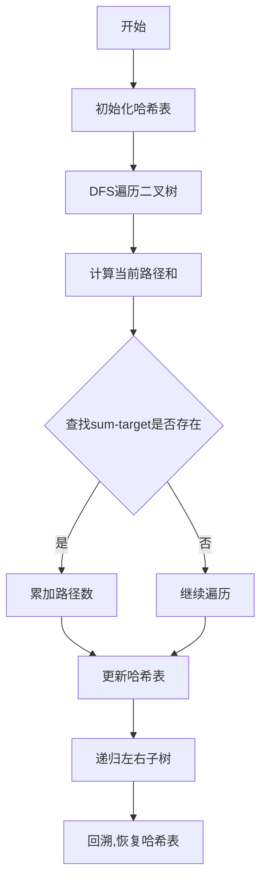

# 路径总和 III

## 题目链接
[路径总和 III](https://leetcode.cn/problems/path-sum-iii/)

## 参考题解
[灵神题解](https://leetcode.cn/problems/path-sum-iii/solutions/2784856/zuo-fa-he-560-ti-shi-yi-yang-de-pythonja-fmzo/?envType=study-plan-v2&envId=top-100-liked)

## 核心思路
1. 将问题转化为求前缀和
2. 使用哈希表记录路径上的前缀和
3. 类似于"和为k的子数组"的思路

## 代码实现
```javascript
var pathSum = function(root, targetSum) {
    if (!root) return 0;
    const map = new Map();
    map.set(0n, 1);
    
    const dfs = (node, sum) => {
        if (!node) return 0;
        
        sum += BigInt(node.val);
        let cnt = map.get(sum - BigInt(targetSum)) || 0;
        map.set(sum, (map.get(sum) || 0) + 1);
        
        cnt += dfs(node.left, sum);
        cnt += dfs(node.right, sum);
        
        map.set(sum, map.get(sum) - 1);
        return cnt;
    };
    
    return dfs(root, 0n);
};
```

## 流程图


## 关键点说明
1. 使用BigInt处理大数
2. 哈希表记录前缀和出现次数
3. 回溯时需要恢复哈希表状态
4. 初始化map.set(0n, 1)处理从根节点开始的路径

## 复杂度分析
- 时间复杂度: O(N), N为节点数
- 空间复杂度: O(H), H为树的高度

## 示例说明
```
输入:
      10
     /  \
    5   -3
   / \    \
  3   2   11
 / \   \
3  -2   1

targetSum = 8

输出: 3
解释:
1. 5 -> 3
2. 5 -> 2 -> 1
3. -3 -> 11
```


## 详细解析
以下面的树为例，targetSum = 8：
```
      10
     /  \
    5   -3
   / \    \
  3   2   11
 / \   \
3  -2   1
```

让我们跟踪DFS过程中的map、sum和cnt的变化：

1. 初始状态：
   - map = {0n: 1}  // 初始前缀和0出现1次
   - sum = 0n

2. 访问节点10：
   - sum = 0n + 10n = 10n
   - 查找 sum - targetSum = 10n - 8n = 2n  // map中不存在2n
   - map = {0n: 1, 10n: 1}

3. 访问左子树节点5：
   - sum = 10n + 5n = 15n
   - 查找 sum - targetSum = 15n - 8n = 7n  // map中不存在7n
   - map = {0n: 1, 10n: 1, 15n: 1}

4. 访问节点3：
   - sum = 15n + 3n = 18n
   - 查找 sum - targetSum = 18n - 8n = 10n  // map中存在10n，cnt += 1
   - map = {0n: 1, 10n: 1, 15n: 1, 18n: 1}

这样找到了第一条路径：3->5->10 (从下往上看是10->5->3，和为8)

举例说明cnt的累加过程：
```javascript
// 假设当前在节点3
sum = 18n
targetSum = 8n
difference = sum - targetSum = 10n

// 因为map中存在10n，说明从根节点到当前节点的路径中，
// 存在一个前缀和为10n的位置，从该位置到当前节点的路径和正好为8
cnt = map.get(10n) = 1
```

map的关键作用：
1. key: 存储前缀和（从根节点到当前节点的路径和）
2. value: 该前缀和出现的次数

为什么需要回溯（map.set(sum, map.get(sum) - 1)）：
```
      10
     /  \
    5    -3
```
当遍历完节点5后，回溯到10时，需要删除15n这个前缀和，因为它只在左子树路径上有效，访问右子树时不应该被计算在内。

完整的前缀和变化示例：
```
路径: 10 -> 5 -> 3
前缀和序列: [10, 15, 18]
map状态: {0n:1, 10n:1, 15n:1, 18n:1}

回溯到5，准备访问2时：
map状态: {0n:1, 10n:1, 15n:1}  // 18n被移除

路径: 10 -> 5 -> 2
前缀和序列: [10, 15, 17]
map状态: {0n:1, 10n:1, 15n:1, 17n:1}
```

这种方法本质上是在找：当前前缀和sum与目标值targetSum的差值(sum - targetSum)是否作为前缀和出现过，出现过几次。每出现一次，就说明存在一条路径的和等于targetSum。
