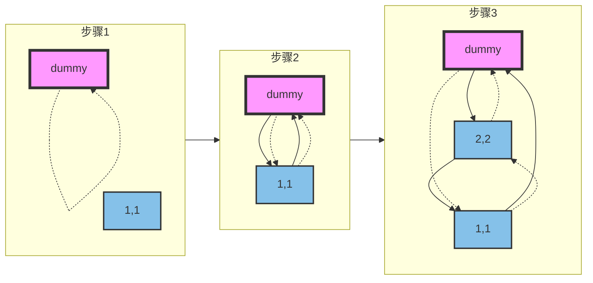
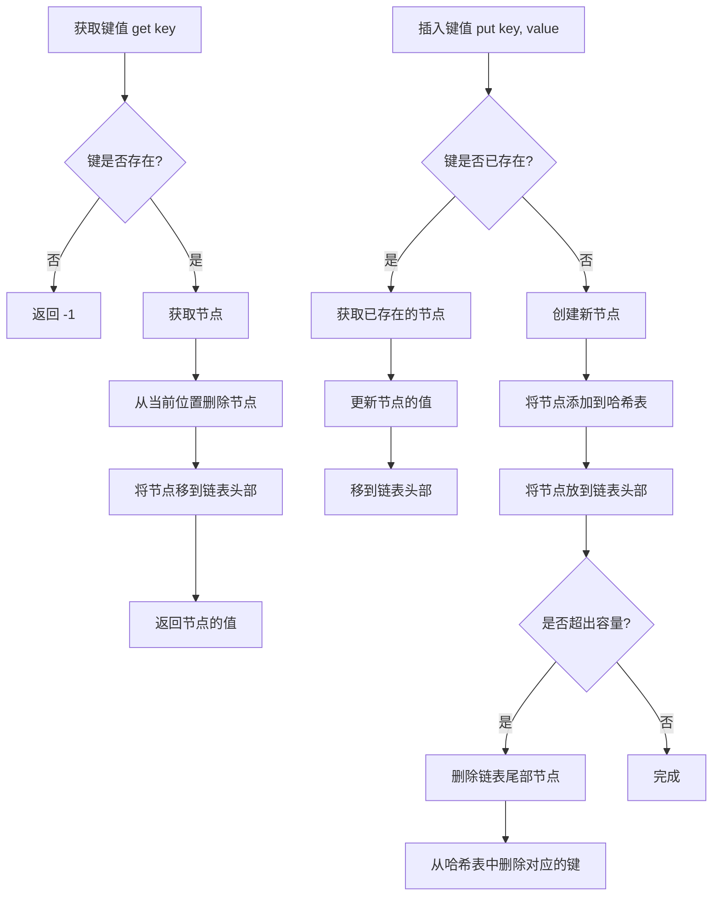

# LRU缓存

## 题目链接
[LRU缓存](https://leetcode.cn/problems/lru-cache/?envType=study-plan-v2&envId=top-100-liked)

## 参考题解
[灵神图解](https://leetcode.cn/problems/lru-cache/solutions/2456294/tu-jie-yi-zhang-tu-miao-dong-lrupythonja-czgt/?envType=study-plan-v2&envId=top-100-liked)

最终代码
```javascript
class Node {
    constructor(key = 0, value = 0) {
        this.key = key;
        this.value = value;
        this.prev = null;
        this.next = null;
    }
}

class LRUCache {
    constructor(capacity) {
        this.capacity = capacity;
        this.dummy = new Node(); // 哨兵节点
        this.dummy.prev = this.dummy;
        this.dummy.next = this.dummy;
        this.keyToNode = new Map();
    }

    // 获取 key 对应的节点，同时把该节点移到链表头部
    #getNode(key) {
        if (!this.keyToNode.has(key)) { // 没有这本书
            return null;
        }
        const node = this.keyToNode.get(key); // 有这本书
        this.#remove(node); // 把这本书抽出来
        this.#pushFront(node); // 放在最上面
        return node;
    }

    get(key) {
        const node = this.#getNode(key);
        return node ? node.value : -1;
    }

    put(key, value) {
        let node = this.#getNode(key);
        if (node) { // 有这本书
            node.value = value; // 更新 value
            return;
        }
        node = new Node(key, value) // 新书
        this.keyToNode.set(key, node);
        this.#pushFront(node); // 放在最上面
        if (this.keyToNode.size > this.capacity) { // 书太多了
            const backNode = this.dummy.prev;
            this.keyToNode.delete(backNode.key);
            this.#remove(backNode); // 去掉最后一本书
        }
    }

    // 删除一个节点（抽出一本书）
    #remove(x) {
        x.prev.next = x.next;
        x.next.prev = x.prev;
    }

    // 在链表头添加一个节点（把一本书放在最上面）
    #pushFront(x) {
        x.prev = this.dummy;
        x.next = this.dummy.next;
        x.prev.next = x;
        x.next.prev = x;
    }
}

```

初始化dummy和第一次put的流程图 | 实线箭头表示next指针,虚线箭头表示prev指针


整体流程图

