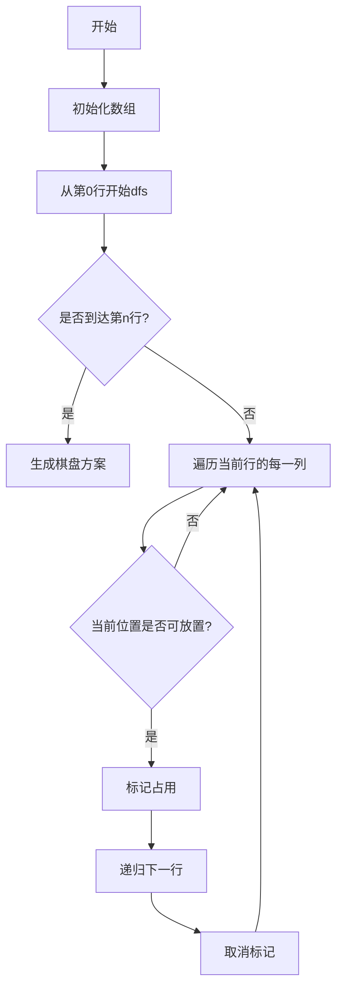

# N皇后问题解析

## 问题描述
N皇后问题要求在N×N的棋盘上放置N个皇后，使得它们互不攻击。皇后可以攻击同一行、同一列或同一斜线上的棋子。要求返回所有不同的解决方案。

## 题目链接
[N皇后](https://leetcode.cn/problems/n-queens/description/?envType=daily-question&envId=2024-12-01)

## 核心思路
使用回溯法解决，通过三个数组记录已经放置的皇后的攻击范围：
- `onPath[]`: 记录每一列是否被占用
- `slashes1[]`: 记录主对角线（左上到右下）是否被占用
- `slashes2[]`: 记录副对角线（右上到左下）是否被占用
- `col[]`: 记录每一行皇后的列位置

## 流程图



## 代码实现
```javascript
var solveNQueens = function(n) {
    let ans = []
    let onPath = new Array(n).fill(false)
    const m = 2 * n
    let slashes1 = new Array(m).fill(false)
    let slashes2 = new Array(m).fill(false)
    let col = new Array(n).fill(0)

    const dfs = r => {
        if (r === n) {
            ans.push(col.map(c => '.'.repeat(c) + 'Q' + '.'.repeat(n - c - 1)))
            return
        }

        for (let i = 0; i < n; ++i) {
            if (!onPath[i] && !slashes1[r + i] && !slashes2[r - i]) {
                col[r] = i
                onPath[i] = slashes1[r + i] = slashes2[r - i] = true
                dfs(r + 1)
                onPath[i] = slashes1[r + i] = slashes2[r - i] = false
            }
        }
    }
    dfs(0)
    return ans
};
```

## 关键数组说明

1. `onPath[]`数组：
   - 长度为n
   - 索引表示列号
   - 值为true表示该列已被占用

2. `slashes1[]`数组（主对角线）：
   - 长度为2n
   - 同一主对角线上的格子满足：r+i值相同
   - 使用r+i作为索引

3. `slashes2[]`数组（副对角线）：
   - 长度为2n
   - 同一副对角线上的格子满足：r-i值相同
   - 使用r-i作为索引

4. `col[]`数组：
   - 长度为n
   - 索引表示行号
   - 值表示该行皇后所在的列号

## 示例说明
对于4皇后问题，一个有效解为：
```
. Q . .
. . . Q
Q . . .
. . Q .
```

此时col数组为[1,3,0,2]，表示：
- 第0行皇后在第1列
- 第1行皇后在第3列
- 第2行皇后在第0列
- 第3行皇后在第2列

让我们以放置第一个皇后(第0行第1列)为例，展示各个数组的状态：

```
. Q . .  // 在(0,1)位置放置皇后
. . . .
. . . .
. . . .
```

此时数组状态：
- `onPath = [false, true, false, false]`  
  // 第1列被占用

- `slashes1 = [false, true, false, false, false, false, false, false]`  
  // r+i = 0+1 = 1的对角线被占用

- `slashes2 = [false, true, false, false, false, false, false, false]`  
  // r-i = 0-1 = -1的对角线被占用（在数组中的索引为-1+4=3）

放置第二个皇后(第1行第3列)后：
```
. Q . .
. . . Q
. . . .
. . . .
```

数组状态更新为：
- `onPath = [false, true, false, true]`  
  // 第1列和第3列被占用

- `slashes1 = [false, true, false, false, true, false, false, false]`  
  // r+i = 0+1 = 1和r+i = 1+3 = 4的对角线被占用

- `slashes2 = [false, true, false, false, true, false, false, false]`  
  // r-i = 0-1 = -1和r-i = 1-3 = -2的对角线被占用

这些数组帮助我们快速判断新位置是否可以放置皇后：
1. 检查列是否被占用：查看onPath[i]
2. 检查主对角线：查看slashes1[r+i]
3. 检查副对角线：查看slashes2[r-i]

## 代码优化技巧
1. 使用`String.repeat()`方法生成棋盘字符串
2. 回溯时注意恢复现场，包括所有标记数组
3. 利用数组下标可以为负数的特性处理副对角线